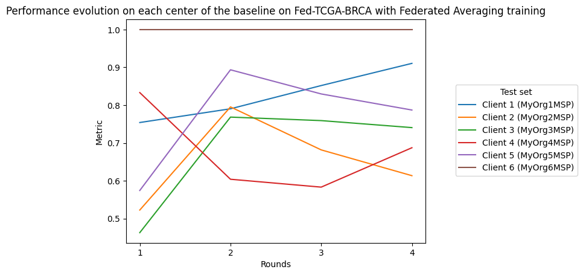

# Substra

[**Substra**](https://docs.substra.org/en/0.21.0/) is an **open source** federated learning framework. It provides a flexible **python interface** and a **web app** to run federated learning training at scale.

Substra main usage is a **production one**. It has already been deployed and used by hospitals and biotech companies (see the [MELLODDY](https://www.melloddy.eu/) project for instance).

Yet [**Substra**](https://docs.substra.org/en/0.21.0/) can also be used on a single machine on a virtually splitted dataset for two use cases:

- debugging code before launching experiments on a real network
- performing FL simulations

Substra was created by [**Owkin**](https://owkin.com/) and is now hosted by the [Linux Foundation for AI and Data](https://lfaidata.foundation/).

# SubstraFL example on FLamby TCGA BRCA dataset

This example illustrate the basic usage of SubstraFL, and propose a model training by Federated Learning
using the Federated Averaging strategy on the TCGA BRCA dataset.

The objective of this example is to launch a *federated learning* experiment on the six centers provided on Flamby
(called organization on Substra), using the **FedAvg strategy** on the **baseline model**.

This example does not use the deployed platform of Substra and will run in local mode.

## Requirements

To run this example locally, please make sure to download and unzip in the same directory as this example the assets needed to run it:

Please ensure to have all the libraries installed, a `requirements.txt` file is included in the example.

You can run the command: `pip install -r requirements.txt` to install them.

## Objective

This example will run a federated training on all 6 centers of the TCGA BRCA [**FLamby**](https://github.com/owkin/FLamby) dataset.

This example shows how to interface [**Substra**](https://docs.substra.org/en/0.21.0/) with [**FLamby**](https://github.com/owkin/FLamby).

This example runs in local mode, simulating a **federated learning** experiment.

# Client and data preparation

## Imports

```python
import os
import pathlib
import zipfile
```

# Creating the Substra Client

We work with six different organizations, defined by their IDs. All organizations provide a FLamby dataset configuration. One of them will also provide the algorithm and will register the machine learning tasks.

Once these variables defined, we can create our different [**Substra Client**](https://docs.substra.org/en/0.21.0/documentation/references/sdk.html#client) (one for each organization/center).

```python
from substra import Client
from flamby.datasets.fed_tcga_brca import NUM_CLIENTS

# Choose the subprocess mode to locally simulate the FL process
os.environ["DEBUG_SPAWNER"] = "subprocess"

# Create the substra clients
clients = [Client(debug=True) for _ in range(NUM_CLIENTS)]
clients = {client.organization_info().organization_id: client for client in clients}

# Store their IDs
ORGS_ID = list(clients.keys())

# The org id on which your computation tasks are registered
ALGO_ORG_ID = ORGS_ID[0]

assets_directory = pathlib.Path.cwd() / "assets"
```

# Registering assets

## Substra and Substrafl imports

```python
from substra.sdk.schemas import (
    DatasetSpec,
    AlgoInputSpec,
    AlgoOutputSpec,
    AssetKind,
    Permissions,
    DataSampleSpec,
    AlgoCategory,
    AlgoSpec,
)
from substrafl.nodes import TestDataNode, TrainDataNode
```

## Permissions

As data can not be seen once it is registered on the platform, we set a [**Permissions**](https://docs.substra.org/en/0.21.0/documentation/references/sdk_schemas.html#permissions) object for each [**Assets**](https://docs.substra.org/en/0.21.0/documentation/concepts.html#assets), defining their access rights to the different data.

The metadata are visible by all the users of a [**Channel**](https://docs.substra.org/en/0.21.0/additional/glossary.html#term-Channel).

```python
permissions = Permissions(public=False, authorized_ids=ORGS_ID)
```

## Adding Metrics

A metric corresponds to an algorithm used to compute the score of prediction on a **datasample**.
Concretely, a metric corresponds to an archive *(tar or zip file)*, automatically build from:

- a **Python scripts** that implement the metric computation
- a [**Dockerfile**](https://docs.docker.com/engine/reference/builder/) to specify the required dependencies of the **Python scripts**

```python
inputs_metrics = [
    AlgoInputSpec(identifier="datasamples", kind=AssetKind.data_sample, optional=False, multiple=True),
    AlgoInputSpec(identifier="opener", kind=AssetKind.data_manager, optional=False, multiple=False),
    AlgoInputSpec(identifier="predictions", kind=AssetKind.model, optional=False, multiple=False),
]

outputs_metrics = [AlgoOutputSpec(identifier="performance", kind=AssetKind.performance, multiple=False)]

metric_algo = AlgoSpec(
    category=AlgoCategory.metric,
    inputs=inputs_metrics,
    outputs=outputs_metrics,
    name="TCGA BRCA metric",
    description=assets_directory / "metric" / "description.md",
    file=assets_directory / "metric" / "metrics.zip",
    permissions=permissions,
)

METRICS_DOCKERFILE_FILES = [
    assets_directory / "metric" / "metrics.py",
    assets_directory / "metric" / "Dockerfile",
]

archive_path = metric_algo.file
with zipfile.ZipFile(archive_path, "w") as z:
    for filepath in METRICS_DOCKERFILE_FILES:
        z.write(filepath, arcname=filepath.name)

metric_key = clients[ALGO_ORG_ID].add_algo(metric_algo)
```

## Dataset, Train data nodes and Test data nodes

A [**Dataset**](https://docs.substra.org/en/0.21.0/documentation/concepts.html#dataset) is composed of an **opener**, which is a Python script with the instruction of *how to load the data* from the files in memory, and a **description markdown** file.

The [**Dataset**](https://docs.substra.org/en/0.21.0/documentation/concepts.html#dataset) object itself does not contain the data. The proper asset to access them is the **datasample asset**.

A **datasample** contains a local path to the data, and the key identifying the [**Dataset**](https://docs.substra.org/en/0.21.0/documentation/concepts.html#dataset) in order to have access to the proper `opener.py` file.

To interface with [**FLamby**](https://github.com/owkin/FLamby), the utilization of the opener and datasample is a bit bypassed here. [**Substra**](https://docs.substra.org/en/0.21.0/) is a library built to be deployed on a real federated networks, where the path to the data is provided to the opener in order to load and read them in a personalized way directly on the organization.

As we directly load a torch dataset from Flamby, the `folders` parameters is unused and the path usually leading to the data will point out a empty folder in this example.

Now that all our [**Assets**](https://docs.substra.org/en/0.21.0/documentation/concepts.html#assets) are well defined, we can create the [**TrainDataNodes**](https://docs.substra.org/en/0.21.0/substrafl_doc/api/nodes.html#traindatanode) and the [**TestDataNodes**](https://docs.substra.org/en/0.21.0/substrafl_doc/api/nodes.html#testdatanode) to gathered the [**Datasets**](https://docs.substra.org/en/0.21.0/documentation/concepts.html#dataset) and the **datasamples** on the specified organization.

```python
train_data_nodes = list()
test_data_nodes = list()

empty_path = assets_directory / "empty_datasamples"

for ind, org_id in enumerate(ORGS_ID):
    client = clients[org_id]

    dataset = DatasetSpec(
        name="FLamby",
        type="torchDataset",
        data_opener=assets_directory / "dataset" / f"opener_train_{org_id}.py",
        description=assets_directory / "dataset" / "description.md",
        permissions=permissions,
        logs_permission=permissions,
    )

    # Add the dataset to the client to provide access to the opener in each organization.
    train_dataset_key = client.add_dataset(dataset)
    assert train_dataset_key, "Missing data manager key"

    # Add the training data on each organization.
    data_sample = DataSampleSpec(
        data_manager_keys=[train_dataset_key],
        test_only=False,
        path=empty_path,
    )
    train_datasample_key = client.add_data_sample(
        data_sample,
        local=True,
    )

    # Create the Train Data Node (or training task) and save it in a list
    train_data_node = TrainDataNode(
        organization_id=org_id,
        data_manager_key=train_dataset_key,
        data_sample_keys=[train_datasample_key],
    )
    train_data_nodes.append(train_data_node)

    # Add the testing data.

    test_dataset_key = client.add_dataset(
        DatasetSpec(
            name="FLamby",
            type="torchDataset",
            data_opener=assets_directory / "dataset" / f"opener_test_{org_id}.py",
            description=assets_directory / "dataset" / "description.md",
            permissions=permissions,
            logs_permission=permissions,
        )
    )
    assert test_dataset_key, "Missing data manager key"

    data_sample = DataSampleSpec(
        data_manager_keys=[test_dataset_key],
        test_only=True,
        path=empty_path,
    )
    test_datasample_key = client.add_data_sample(
        data_sample,
        local=True,
    )

    # Create the Test Data Node (or testing task) and save it in a list
    test_data_node = TestDataNode(
        organization_id=ALGO_ORG_ID,
        data_manager_key=test_dataset_key,
        test_data_sample_keys=[test_datasample_key],
        metric_keys=[metric_key],
    )
    test_data_nodes.append(test_data_node)
```

## Machine Learning specification

```python
from flamby.datasets.fed_tcga_brca import (
    FedTcgaBrca,
    Baseline,
    BaselineLoss,
    Optimizer,
    BATCH_SIZE,
    LR,
)


model = Baseline()
optimizer = Optimizer(model.parameters(), lr=LR)
criterion = BaselineLoss()
```

## Substrafl imports

```python

from typing import Any

from substrafl.algorithms.pytorch import TorchFedAvgAlgo
from substrafl.dependency import Dependency
from substrafl.strategies import FedAvg
from substrafl.nodes import AggregationNode
from substrafl.evaluation_strategy import EvaluationStrategy
from substrafl.index_generator import NpIndexGenerator
from substrafl.experiment import execute_experiment

import torch

```

## Substrafl algo definition

To instantiate a Substrafl [**Torch Algorithm**](https://docs.substra.org/en/0.21.0/substrafl_doc/api/algorithms.html#torch-algorithms), you need to define a torch Dataset with a specific `__init__` signature, that must contain (self, x, y, is_inference). This torch Dataset is useful to preprocess your data on the `__getitem__` function.

This dataset is passed **as a class** to the [**Torch Algorithms**](https://docs.substra.org/en/0.21.0/substrafl_doc/api/algorithms.html#torch-algorithms).
Indeed, this torch Dataset will be instantiated within the algorithm, using the opener functions as x and y parameters.

The index generator will be used a the batch sampler of the dataset, in order to save the state of the seen samples during the training, as Federated Algorithms have a notion of `num_updates`, which forced the batch sampler of the dataset to be stateful.

`NUM_UPDATES` is the number of model update between each FL strategy aggregation.

Concerning the [**TorchFedAvgAlgo**](https://docs.substra.org/en/0.21.0/substrafl_doc/api/algorithms.html#torchfedavgalgo) interaction with [**FLamby**](https://github.com/owkin/FLamby), we need to overwrite the `_local_predict` function, used to compute the predictions of the model. In the default `_local_predict`provided by **Substrafl**, we assume that the `__getitem__` of the dataset take into account the `is_inference` argument to only return the inputs samples.

But as the `__getitem__` function is provided by [**FLamby**](https://github.com/owkin/FLamby), the `is_inference` argument is ignored. We need to overwrite the `_local_predict` to change the behavior of the function, and can use this opportunity to optimize the computation time of the function using knowledge of the ouput dimension of the TGCA-BRCA dataset.

```python
NUM_UPDATES = 16
SEED = 42

index_generator = NpIndexGenerator(
    batch_size=BATCH_SIZE,
    num_updates=NUM_UPDATES,
)


class TorchDataset(FedTcgaBrca):

    def __init__(self, x, y, is_inference):
        config = x
        super().__init__(**config)


class MyAlgo(TorchFedAvgAlgo):
    def __init__(self):
        super().__init__(
            model=model,
            criterion=criterion,
            optimizer=optimizer,
            index_generator=index_generator,
            dataset=TorchDataset,
            seed=SEED,
        )

    def _local_predict(self, predict_dataset: torch.utils.data.Dataset, predictions_path):

        batch_size = self._index_generator.batch_size
        predict_loader = torch.utils.data.DataLoader(predict_dataset, batch_size=batch_size)

        self._model.eval()

        # The output dimension of the model is of size (1,)
        predictions = torch.zeros((len(predict_dataset), 1))

        with torch.inference_mode():
            for i, (x, _) in enumerate(predict_loader):
                x = x.to(self._device)
                predictions[i * batch_size: (i+1) * batch_size] = self._model(x)

        predictions = predictions.cpu().detach()
        self._save_predictions(predictions, predictions_path)
```

## Algo dependencies

The **dependencies** needed for the [**Torch Algorithms**](https://docs.substra.org/en/0.21.0/substrafl_doc/api/algorithms.html#torch-algorithms) are specified by a [**Dependency**](https://docs.substra.org/en/0.21.0/substrafl_doc/api/dependency.html) object, in order to install the right library in the Python environment of each organization.

In a **local subprocess** mode (selected mode for this example), the algo dependencies are not installed as the local environment is used instead. The following cell is given as an example of use of the [**Dependency**](https://docs.substra.org/en/0.21.0/substrafl_doc/api/dependency.html) object.

```python
algo_deps = Dependency(pypi_dependencies=["torch==1.11.0"])
```

## Federated Learning strategies

For this example, we choose to use the [**Federated averaging Strategy**](https://docs.substra.org/en/0.21.0/substrafl_doc/api/strategies.html)), based on the [FedAvg paper by McMahan et al., 2017](https://arxiv.org/abs/1602.05629).

```python
strategy = FedAvg()
```

## Running the experiment

We now have all the necessary objects to launch our experiment. Below a summary of all the objects we created so far:

- A [**Client**](https://docs.substra.org/en/0.21.0/documentation/references/sdk.html#client) to orchestrate all the assets of our project, using their keys to identify them
- An [**Torch Algorithms**](https://docs.substra.org/en/0.21.0/substrafl_doc/api/algorithms.html#torch-algorithms), to define the training parameters *(optimizer, train function, predict function, etc...)*
- A [**Strategies**](https://docs.substra.org/en/0.21.0/substrafl_doc/api/strategies.html), to specify the federated learning aggregation operation
- [**TrainDataNode**](https://docs.substra.org/en/0.21.0/substrafl_doc/api/nodes.html#traindatanode), to indicate where we can process training task, on which data and using which *opener*
- An [**Evaluation Strategy**](https://docs.substra.org/en/0.21.0/substrafl_doc/api/evaluation_strategy.html), to define where and at which frequency we evaluate the model
- An [**AggregationNode**](https://docs.substra.org/en/0.21.0/substrafl_doc/api/nodes.html#aggregationnode), to specify the node on which the aggregation operation will be computed
- The **number of round**, a round being defined by a local training step followed by an aggregation operation
- An **experiment folder** to save a summary of the operation made
- The [**Dependency**](https://docs.substra.org/en/0.21.0/substrafl_doc/api/dependency.html) to define the libraries the experiment needs to run.

```python
aggregation_node = AggregationNode(ALGO_ORG_ID)

my_eval_strategy = EvaluationStrategy(test_data_nodes=test_data_nodes, rounds=1)

# Number of time to apply the compute plan.
NUM_ROUNDS = 4

compute_plan = execute_experiment(
    client=clients[ALGO_ORG_ID],
    algo=MyAlgo(),
    strategy=strategy,
    train_data_nodes=train_data_nodes,
    evaluation_strategy=my_eval_strategy,
    aggregation_node=aggregation_node,
    num_rounds=NUM_ROUNDS,
    experiment_folder=str(pathlib.Path.cwd() / "experiment_summaries"),
    dependencies=algo_deps,
)
```

    2022-10-07 11:51:32,650 - INFO - Building the compute plan.
    2022-10-07 11:51:32,658 - INFO - Registering the algorithm to Substra.
    2022-10-07 11:51:32,689 - INFO - Registering the compute plan to Substra.
    2022-10-07 11:51:32,691 - INFO - Experiment summary saved to FLamby/integration/Substra/experiment_summaries/YOUR_CP_KEY.json

    Compute plan progress:   0%|          | 0/82 [00:00<?, ?it/s]


    2022-10-07 11:54:35,496 - INFO - The compute plan has been registered to Substra, its key is YOUR_CP_KEY.

## Plot results

```python
import pandas as pd
import matplotlib.pyplot as plt
```

```python
plt.title("Performance evolution on each center of the baseline on Fed-TCGA-BRCA with Federated Averaging training")
plt.xlabel("Rounds")
plt.ylabel("Metric")

performance_df = pd.DataFrame(client.get_performances(compute_plan.key).dict())

for i, id in enumerate(ORGS_ID):
    df = performance_df.query(f"worker == '{id}'")
    plt.plot(df["round_idx"], df["performance"], label=f"Client {i} ({id})")

plt.legend(loc=(1.1, 0.3), title="Test set")
plt.show()
```


The last test client has only one event, which reduces the number of admissible pairs to be formed in the concordance index computation, which in turn explains to some extents the flat line.
## Download a model

After the experiment, you might be interested in getting your trained model.
To do so, you will need the source code in order to reload in memory your code architecture.

You have the option to choose the client and the round you are interested in.

If `round_idx` is set to `None`, the last round will be selected by default.

```python
from substrafl.model_loading import download_algo_files
from substrafl.model_loading import load_algo
```

```python
client_to_dowload_from = ALGO_ORG_ID
round_idx = None

folder = str(pathlib.Path.cwd() / "experiment_summaries" / compute_plan.key / ALGO_ORG_ID / (round_idx or "last"))

download_algo_files(
    client=clients[client_to_dowload_from],
    compute_plan_key=compute_plan.key,
    round_idx=round_idx,
    dest_folder=folder,
)

model = load_algo(input_folder=folder)._model

print(model)
print([p for p in model.parameters()])
```

    Baseline(
      (fc): Linear(in_features=39, out_features=1, bias=True)
    )
    [Parameter containing:
    tensor([[ 0.0145,  0.6920, -0.2456, -0.2081, -0.0139, -0.2052,  0.0050, -0.2389,
             -0.5810, -0.2437, -0.6159, -0.2866, -0.0065, -0.4236, -0.4062, -0.4992,
              0.1233,  0.3074, -0.8318, -0.0700,  0.0087, -0.1842, -0.5766,  0.2790,
             -0.1619, -0.1921, -0.0589, -0.2146,  0.0014, -0.0935,  0.2092,  0.5909,
             -0.5916, -0.6775, -0.4972, -0.3845, -0.4516,  0.1292,  0.3012]],
           requires_grad=True), Parameter containing:
    tensor([0.0324], requires_grad=True)]

```python

```
